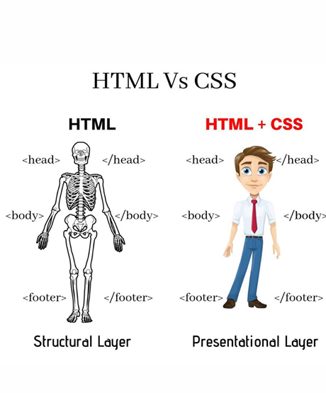

# Cascading Style Sheets (CSS)
#
# Basic CSS
## Content vs. Presentation
### Hầu hết các thẻ HTML xác định loại nội dung, tính độc lập của trình bày.
#### Ngoại lệ
#### <b> ...... </b> Đối với văn bản in đậm và <i> ..... </i> cho văn bản in nghiêng
### Style sheets associate/ Bảng định kiểu liên kết các định dạng trình bày với các phần tử HTML
#### CSS1: xuất bản năm 1996
#### CSS2: xuất bản năm 1998
#### CSS3: được chia thành nhiều mô-đun riêng biệt

### Style sheets có thể được sử dụng để chỉ định cách hiển thị bảng, cách trình bày danh sách, v.v
### HTML style sheets được gọi là Cascading Style Sheets, vì có thể được định nghĩa ở ba cấp độ khác nhau
#### inline style sheets áp dụng cho nội dung của một phần tử HTML duy nhất
#### document style sheets áp dụng cho toàn bộ BODY của một tài liệu
#### external style sheets có thể được liên kết và áp dụng cho nhiều tài liệu
### Các bảng định kiểu cấp thấp hơn có thể ghi đè các bảng định kiểu cấp cao hơn( lower-level style sheets can override higher-level style sheets)
## Selectors 
#
###  ```#id #firstname Selects the element with id="firstname"```
###  ```.class .intro Selects all elements with class="intro"```
###  ```element.class p.intro Selects only <p> elements with class="intro```
###  ```* * Selects all elements```
###  ```element p Selects all <p> elements```
### ```element, element... div, p Selects all <div> elements and all <p> elements```
## Inline Style Sheets
### Sử dụng thuộc tính style, chúng ta có thể chỉ định kiểu trình bày cho single HTML element
### Trong tag, trình tự danh sách của property:value các cặp được phân tách bằng dấu chấm phẩy
## Document Style Sheets
### Bảng định kiểu nội tuyến áp dụng cho các phần tử riêng lẻ trong trang.
#### Sử dụng các chỉ thị kiểu nội tuyến có thể dẫn đến sự không nhất quán, vì các phần tử tương tự được định dạng khác nhau
#### Định nghĩa nội tuyến kết hợp nội dung và trình bày
### Theo nguyên tắc chung, các chỉ thị style sheet nội tuyến nên được sử dụng một cách tiết kiệm nhất có thể.
### Ngoài ra, bảng định dạng tài liệu cho phép tách nội dung và bản trình bày rõ ràng hơn.
#### định nghĩa kiểu được đặt trong <head> trang( trong STYLE tags)
#### có thể áp dụng cho tất cả các phần tử hoặc một lớp con của các phần tử trong toàn bộ trang
## External Style Sheets
### Mô-đun là chìa khóa để phát triển và tái sử dụng phần mềm
#### đóng gói và cung cấp để tái sử dụng
#### Thư viện trung tâm giúp bạn có thể thực hiện một thay đổi duy nhất và truyền bá các thay đổi
### Bảng định kiểu bên ngoài đặt các định nghĩa kiểu trong các tệp riêng biệt
#### Nhiều trang có thể liên kết đến cùng một bảng định kiểu, giao diện nhất quán trên một trang web
#### có thể thực hiện một thay đổi duy nhất và tự động lan truyền
#### đại diện cho sự tách biệt nội dung / đại diện cuối cùng
## Modularity & Style Sheets
# Advaned CSS
## Rounded Corners (Các góc bo tròn)
### Với thuộc tính CSS border-radius, bạn có thể cung cấp bất kỳ phần tử nào “rounded corners”.
#### Rounded corners đối với một phần tử có đường viền
#### Rounded corners đối với một phần tử có màu nền được chỉ định
## Universal, Child, and Adjacent Selectors
### Universal selectors: đặt kiểu chung cho một trang hoặc như một hậu duệ của bộ chọn để đặt kiểu của mọi thứ trong một cái gì đó.
### Child selectors: Một ký hiệu lớn hơn (">") có thể được sử dụng để chỉ định một cái gì đó là con của một cái gì đó khác, nghĩa là, một cái gì đó ngay lập tức lồng vào một cái gì đó
### Adjacent selectors: Dấu cộng ("+") được sử dụng để nhắm mục tiêu một anh chị em liền kề của một phần tử, về cơ bản, một cái gì đó ngay sau một cái gì đó.
## Advanced Colors
### Chúng ta đã biết rằng màu sắc có thể được xác định bởi name, RGB, or hex values
### CSS 3 cũng cho phép bạn vẽ đi với HSL — hue, saturation, and lightness
### Giá trị màu HSL được chỉ định bằng: hsl(hue, saturation, lightness)[HSL (màu sắc, độ bão hòa, độ sáng)]
#### Hue là một độ trên bánh xe màu (từ 0 đến 360):
##### 0 (hoặc 360) là màu đỏ
##### 120 là màu xanh lá cây
##### 240 là màu xanh lam
#### Saturation là giá trị phần trăm: 100% là màu đầy đủ
#### Lightness cũng là một tỷ lệ phần trăm; 0% là tối (đen) và 100% là trắng.
## CSS Transitions
### Transitions cho phép bạn dễ dàng tạo hoạt ảnh cho các phần thiết kế của mình mà không cần những thứ như JavaScript
#### transition-property: thuộc tính nào (hoặc các thuộc tính) sẽ chuyển đổi
#### transition-duration: Quá trình chuyển đổi mất bao lâu
#### transition-timing-function: nếu quá trình chuyển đổi diễn ra ở tốc độ không đổi hoặc nếu nó tăng tốc và giảm tốc
#### transition-delay:Chờ bao lâu cho đến khi quá trình chuyển đổi diễn ra
## Backgrounds: Multiples, Size, and Origin
### Multiples background: CSS3 cho phép bạn áp dụng nhiều hình nền vào một hộp duy nhất bằng cách đặt các vị trí hình ảnh trong một danh sách được phân tách bằng dấu phẩy
## Transformations
### CSS transforms cho phép bạn move, rotate, scale, and skew elements.(Di chuyển, xoay, chia tỷ lệ và nghiêng các phần tử.)
#### translate() di chuyển một phần tử từ vị trí hiện tại của nó (theo các tham số được đưa ra cho trục X và trục Y).
#### rotate() quay một phần tử theo chiều kim đồng hồ hoặc ngược chiều kim đồng hồ theo một mức độ nhất định.
#### scale() tăng hoặc giảm kích thước của một phần tử (theo các thông số được đưa ra cho chiều rộng và chiều cao).
#### skew() phương thức làm lệch một phần tử dọc theo trục X và Y theo các góc đã cho
#### matrix() phương pháp kết hợp tất cả các phương pháp biến đổi 2D thành một
## Position
### chỉ định loại phương pháp định vị được sử dụng cho một phần tử
#### static: không bị ảnh hưởng bởi các thuộc tính trên, dưới, trái và phải.
#### relative: được định vị tương đối với vị trí bình thường của nó.
#### fixed: luôn ở cùng một vị trí ngay cả khi trang được cuộn
#### absolute: được định vị liên quan đến tổ tiên được định vị gần nhất (hoặc nội dung tài liệu nếu không có tổ tiên)
#### sticky: được định vị dựa trên vị trí cuộn của người dùng.