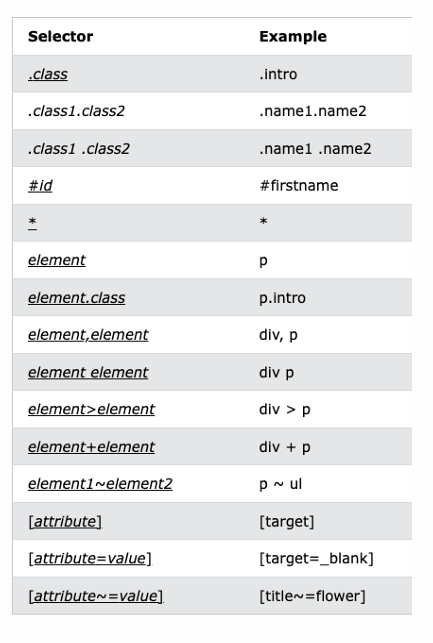
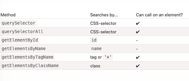
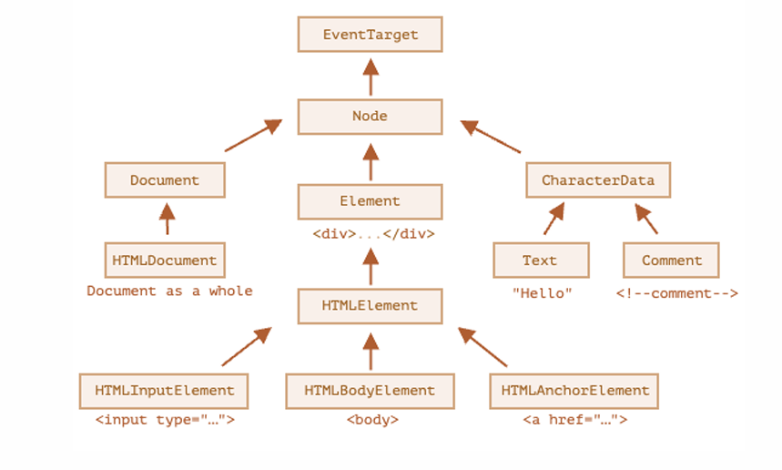
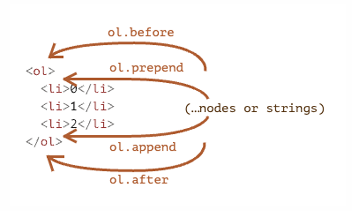

# Document Object Model (DOM)
## Browser environment
- Ngôn ngữ JavaScript ban đầu được tạo ra cho trình duyệt web
- Kể từ đó, nó đã phát triển thành một ngôn ngữ với nhiều nền tảng
- Một nền tảng cung cấp các đối tượng và chức năng của riêng nó ngoài language core.    
    + Web browsers cung cấp một phương tiện để kiểm soát các trang web
    + Node.js cung cấp server-side features
## What is DOM?
- A W3C (World Wide Web Consortium) standard
- API lập trình cho HTML and XML documents. Nó xác định cấu trúc logic của tài liệu và cách tài liệu được truy cập và thao tác.
## DOM (cont. )
- Tiêu chuẩn W3C DOM được chia thành 2 phần:
+ DOM Core - mô hình tiêu chuẩn cho tất cả các loại tài liệu (HTML, XML)
+ DOM HTML - mô hình tiêu chuẩn cho  HTML documents
- DOM HTML định nghĩa
+ The HTML elements as objects
+ The properties of all HTML elements
+ The methods to access all HTML elements
+ The events for all HTML elements
- Nói cách khác: HTML DOM là một tiêu chuẩn về cách nhận, thay đổi, thêm hoặc xóa các phần tử HTML.
## DOM Tree
- Khi một trang web được tải, trình duyệt sẽ tạo một cây
## DOM
- Với mô hình đối tượng, JavaScript nhận được tất cả sức mạnh cần thiết để tạo HTML động:
+ JavaScript có thể thêm, xóa hoặc thay đổi tất cả các HTML elements trong page
+ JavaScript có thể thêm, xóa hoặc thay đổi tất cả các HTML attributes trong page
+ JavaScript có thể thay đổi tất cả các CSS styles trong page
+ JavaScript có thể tạo ra new HTML events hoặc phản ứng với tất cả các HTML events trong trang
## Searching: document.getElementById(id)
- Nếu một phần tử có id attribute, chúng ta có thể lấy phần tử bằng cách sử dụng phương thức document.getElementById(id)
- id phải là duy nhất
+ Chỉ có thể có một phần tử trong tài liệu với id đã cho.
+ Nếu có nhiều phần tử có cùng id, thì hành vi của các phương thức sử dụng nó là không thể đoán trước
- Chỉ document.getElementById, không phải bất kỳ Elem.getElementById nào
+ Phương thức getElementById chỉ có thể được gọi trên document object. Nó tìm kiếm id đã cho trong toàn bộ tài liệu.
## Searching: getElementsBy*
- Ngoài ra còn có các phương pháp khác để tìm kiếm nút
- Ngày nay, chúng chủ yếu là lịch sử, như querySelector mạnh hơn và ngắn hơn để viết.
+ elem.getElementsByTagName(tag)
* e.g., table.getElementsByTagName("td");
+ elem.getElementsByClassName(className)
* e.g., document.getElementsByClassName("example");
+ document.getElementsByName(name)
* input name="animal" type="checkbox" value="Mèo"> document.getElementsByName("animal");
## Searching: querySelectorAll
- Phương pháp linh hoạt nhất: elem.querySelectorAll(css)
- Any CSS selector can be used

- Lời kêu gọi đến  elem.querySelector(css) trả về first cho bộ chọn CSS nhất định
- Kết quả giống như ```elem.querySelectorAll(css)[0]```
+ Sau này đang tìm kiếm tất cả các yếu tố và chọn một
+ elem.querySelector chỉ cần tìm kiếm một. Vì vậy, nó nhanh hơn và cũng ngắn hơn để viết.
## Searching: Summary

- Node properties
+ Các nút DOM khác nhau có thể có các thuộc tính khác nhau.
* Một nút phần tử tương ứng với <a> tag có các thuộc tính liên quan đến liên kết
* Cái tương ứng với <input> có các thuộc tính liên quan đến đầu vào, v.v.
* Các nút văn bản không giống với các nút phần tử
+ Nhưng cũng có những đặc tính và phương pháp chung giữa tất cả chúng
## Node properties: hierarchy

## The “nodeType” property
- The nodeType property provides one more, “old-fashioned” way to get the “type” of a DOM node.
+ It has a numeric value:
+ elem.nodeType == 1 for element nodes,
+ elem.nodeType == 3 for text nodes
+ elem.nodeType == 8 for comment nodes
+ elem.nodeType == 9 for the document object
# Tag: nodeName and tagName
- Given a DOM node, we can read its tag name from nodeName or tagName properties: 
- Is there any difference between tagName and nodeName?
+ The tagName property exists only for Element nodes.
+ The nodeNameis defined for any Node:
* for elements it means the same as tagName.
* for other node types (text, comment, etc.) it has a string with the node type.
## innerHTML: the contents
- The innerHTML property allows to get the HTML inside the element as a string.
- We can also modify it. So it's one of the most powerful ways to change the page.
- The example shows the contents of document.body and then replaces it completely:
## outerHTML: full HTML of the element
- The outerHTML property contains the full HTML of the element. That's like innerHTML plus the element itself.
## nodeValue/data: text node content
- The innerHTML property is only valid for element nodes.
- Other node types, such as text nodes, have their counterpart: nodeValue and data properties.
- These two are almost the same for practical use.
## textContent: pure text
- The textContent provides access to the text inside the element: only text, minus all ```<tags>.```
## Walking the DOM
- Child nodes (or children): elements that are direct children
- Descendants– all elements that are nested in the given one, including children, their children and so on.
## Children: childNodes
- The childNodes collection lists all child nodes, including text nodes.
## Children: firstChild, lastChild
- Properties firstChild and lastChild give fast access to the first and last children
- If there exist child nodes, then the following is always true:
## Modifying the document
- DOM modification is the key to creating "live" pages
- Here we'll see how to create new elements "on the fly" and modify the existing page content.
- To create DOM nodes, there are two methods:
## Insertion methods
- Here are more insertion methods, they specify different places where to insert:
+ node.append(... nodes or strings)– append nodes or strings at the end of node,
+ node.prepend(... nodes or strings)– insert nodes or strings at the beginning of node,
+ node.before(... nodes or strings)– insert nodes or strings before node,
+ node.after(... nodes or strings)– insert nodes or strings after node,
+ node.replaceWith(... nodes or strings)– replace node with the given nodes or strings.
Here's a visual picture of what the methods do:

## Modifying the document: Example
##  Exercise
- Run example exercises at: https://www.w3schools.com/js/js_htmldom.asp
# Browser Object Model (BOM)
## Browser Object Model (BOM)
- here are no official standards for the Browser Object Model (BOM).
- Since modern browsers have implemented (almost) the same methods and properties for JavaScript interactivity, it is often referred to, as methods and properties of the BOM
## Window Object
- The window object is supported by all browsers. It represents the browser's window
- All global JavaScript objects, functions, and variables automatically become members of the window object.
+ Global variables are properties of the window object.
+ Global functions are methods of the window object.
+ Even the document object (of the HTML DOM) is a property of the window object
## Window Size
- Two properties can be used to determine the size of the browser window, both properties return the sizes in pixels
+ window.innerHeight - the inner height of the browser window (in pixels)
+ window.innerWidth - the inner width of the browser window (in pixels)
- Other Window Methods
+ window.open() - open a new window
+ window.close() - close the current window
+ window.moveTo() - move the current window
+ window.resizeTo() - resize the current window
## Window Screen
- The window.screen object contains information about the user's screen.
+ The window.screen object can be written without the window prefix.
- Properties
+ screen.width
+ screen.height
+ screen.availWidth
+ screen.availHeight
+ screen.colorDepth
+ screen.pixelDepth
## Window Location
- The window.location object can be used to get the current page address (URL) and to redirect the browser to a new page.
- [https://www.w3schools.com/js/tryit.asp?filename=tryjs_loc _href](https://www.w3schools.com/js/tryit.asp?filename=tryjs_loc_href)
+ window.location.href returns the URL of the current page
+ window.location.hostname returns the domain name
- ge:
    - /js/tryit.asp
+ window.location.protocol returns the web protocol used : https
## Window History, Window Navigator
- Window Navigator:
+ navigator.appVersion
+ navigator.userAgent
+ navigator.platform
+ language
+ onLine
+ javaEnabled()
- Window History:
+ history.back() - same as clicking back in the browser
+ history.forward() - same as clicking forward in the browser
## Single-Page Application (SPA)
### Multi-Page Application vs Single-Page Application
- Traditional web applications perform most of the application logic on the server
- Single-page applications (SPAs) perform most of the user interface logic in a web browser, communicating with the web server primarily using web API
### What is a Single-Page Application?
-  A single-page app
+ Loads only a single page, and then updates the body content of that single document via JavaScript APIs
+ Examples: Gmail, Google Maps, Tiki, etc.
- A multiple-page app
+ Multiple pages with static information (text, image, etc.)
+ Every change requests rendering a new page from the server => browser reloads the content of a page completely and downloads the resources again
### SPA Advantages
- Faster performance: all the resources are loaded during one session, only the necessary data is changed
- Data caching: provides ability to work offline
- Improved user experience: the use of AJAX and JavaScript frameworks (like React, Angular) allows building a more flexible and responsive interface
### SPA Disadvantages
### MPA Advantages
- Faster initial page load.
- MPAs are easy and good for SEO management.
- MPAs provide lots of analytics and data about how a website works.
### MPA Disadvantages
- Slow performance: application reloads every time a user clicks on a new tab
- Hard to maintain: developers need to maintain each page separately and regularly
- More development time: application has a higher number of features compared to a SPA, so it requires more effort and resources