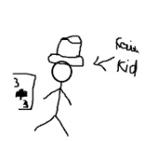

# Learning Web
================

[Mychannel](https://www.youtube.com/@Kto-q4y)

# Kích cỡ chữ
# Phần tiêu đề
## Đây là mục 01
### Đây là mục 1.1
    #### Đây là mục 1.1.1

# List
- dòng 1
+ dòng 2
* dòng 3
# URL/Link
[Mychannel](https://www.youtube.com/@Kto-q4y)
# Embed image

# Checkbox
[] checkbox unchecked
[x] checknox checked
# Front style
*in nghiêng*
**in đậm**
***vừa in nghiêng vừa in đậm***
~~gạch ngang chữ~~

# Chèn code
```print('hello world')```
# Quote
>trích dẫn từ câu 1-7
# Kẻ ngang
***
# Tạo bảng
| STT | Cột 1 | Cột 2|
|:--|:---|:-----|
|1|Dòng 11| Dòng 12|
|2|Dòng 12| Dòng 22|
